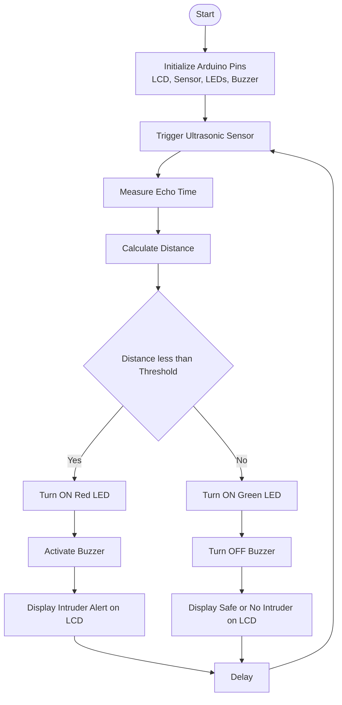
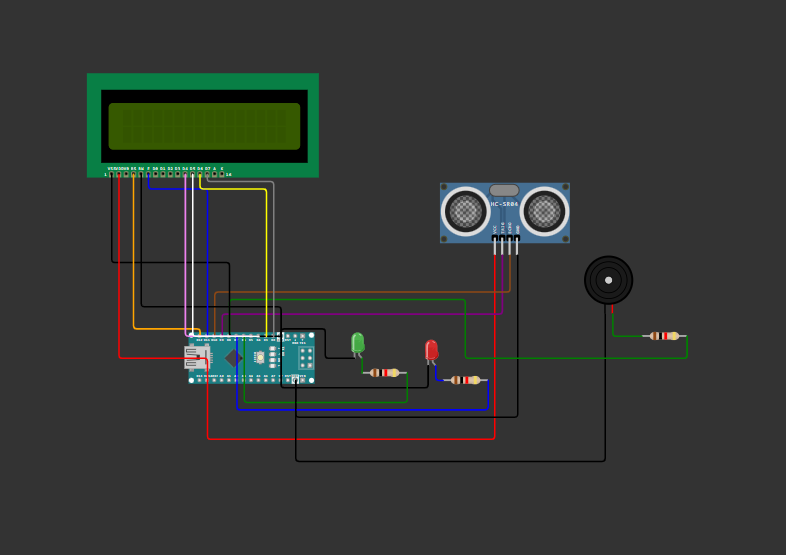

<h1 align="center">🔐 Arduino Alarm System (Embedded C)</h1>

An Embedded Systems project that detects intruders using an ultrasonic sensor and triggers visual and audio alerts.

<h2>📑 Table of Contents</h2>
<ul>
  <li><a href="#-project-title">Project Title</a></li>
  <li><a href="#-brief-one-line-summary">Brief One Line Summary</a></li>
  <li><a href="#-overview">Overview</a></li>
  <li><a href="#-problem-statement">Problem Statement</a></li>
  <li><a href="#-dataset">Dataset</a></li>
  <li><a href="#-tools-and-technologies">Tools and Technologies</a></li>
  <li><a href="#-methods">Methods</a></li>
  <li><a href="#-flowchart">Flowchart</a></li>
  <li><a href="#-key-insights">Key Insights</a></li>
  <li><a href="#-dashboard--model--output">Dashboard / Model / Output</a></li>
  <li><a href="#-how-to-run-this-project">How to Run this Project?</a></li>
  <li><a href="#-results--conclusion">Results & Conclusion</a></li>
  <li><a href="#-future-work">Future Work</a></li>
</ul>

<h2 id="-project-title">📌 Project Title</h2>

Arduino Alarm System using Ultrasonic Sensor

<h2 id="-brief-one-line-summary">📝 Brief One Line Summary</h2>

A real-time intruder detection system built using Arduino Nano, ultrasonic sensor, LCD, LEDs, and a buzzer.

<h2 id="-overview">📖 Overview</h2>

This project demonstrates an Embedded C based Arduino Alarm System designed to detect intruders using
 distance measurement. The system continuously monitors its surroundings using an HC-SR04 ultrasonic sensor.
 When an object enters a predefined range, the system activates an alarm through LEDs and a buzzer and
 displays the alert message on an LCD screen.

<h2 id="-problem-statement">❓ Problem Statement</h2>

Manual surveillance systems are inefficient, time-consuming, and prone to human error.
 There is a need for an automated, low-cost intruder detection system that can provide
 real-time alerts without continuous human monitoring.

<h2 id="-dataset">📊 Dataset</h2>

No external dataset is used in this project. Real-time distance values are obtained directly
 from the ultrasonic sensor during system operation.

<h2 id="-tools-and-technologies">🛠 Tools and Technologies</h2>
<ul>
  <li>Arduino Nano</li>
  <li>Embedded C (Arduino IDE)</li>
  <li>HC-SR04 Ultrasonic Sensor</li>
  <li>16x2 LCD Display</li>
  <li>LEDs and Buzzer</li>
  <li>Wokwi Simulator</li>
</ul>

<h2 id="-methods">⚙️ Methods</h2>
<ul>
  <li>Trigger ultrasonic sensor to emit sound pulses</li>
  <li>Measure echo time to calculate distance</li>
  <li>Compare distance with a predefined threshold</li>
  <li>Activate buzzer and red LED when intruder is detected</li>
  <li>Display system status on LCD</li>
</ul>

<h2 id="-flowchart">🔄 Flowchart</h2>

<h2 id="-key-insights">🔍 Key Insights</h2>
<ul>
  <li>Ultrasonic sensors provide reliable short-range detection</li>
  <li>Embedded systems enable low-cost automation</li>
  <li>Real-time feedback improves security response</li>
</ul>

<h2 id="-dashboard--model--output">📟 Dashboard / Model / Output</h2>
<ul>
  <li>LCD displays system status messages</li>
  <li>Green LED indicates safe condition</li>
  <li>Red LED and buzzer indicate intruder detection</li>
</ul>

  

<h2 id="-how-to-run-this-project">▶️ How to Run this Project?</h2>
<ol>
  <li>Open <b>Arduino IDE</b> or <b>Wokwi Simulator</b></li>
  <li>Load the <b>.ino</b> file</li>
  <li>Connect components as per the circuit diagram</li>
  <li>Upload the code to Arduino Nano or start simulation</li>
  <li>Move an object in front of the ultrasonic sensor</li>
</ol>

<h2 id="-results--conclusion">📈 Results & Conclusion</h2>

The system successfully detects intruders within the defined distance threshold
 and triggers appropriate audio-visual alerts. This project demonstrates the
 practical application of Embedded C in real-time security systems.

<h2 id="-future-work">🚀 Future Work</h2>
<ul>
  <li>Integration with GSM or Wi-Fi for remote alerts</li>
  <li>Password-based keypad security system</li>
  <li>Mobile app notification support</li>
  <li>Camera module integration</li>
</ul>

<b>Developed for educational and embedded systems learning purposes.</b>

